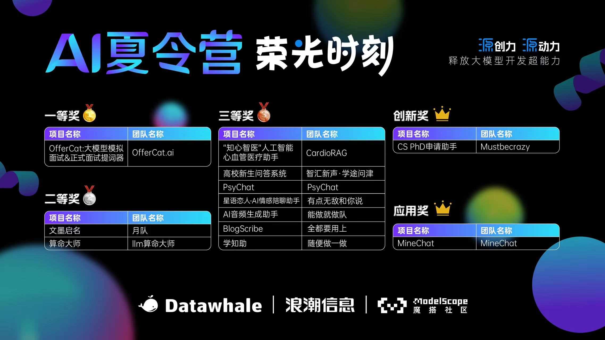

# OfferCat
我们从161支队伍中脱颖而出，获得了DataWhale AI夏令营唯一的 **一等奖&卓越作品奖**，由浪潮信息和ModelScope魔搭社区支持



背八股和刷算法题是一个费时费力而且很痛苦的事，这是每个找实习或找工作的计算机专业学生必须要经历的事。
<br>
但是大模型压缩了这些知识，我们可以用大模型作为面试官模拟面试，大模型可以针对面试表现给用户提供改进建议，并且在面试的时候使用大模型回答的问题作为题词器，则能消除背八股和刷算法题这个痛苦的流程。
<br>
我们的项目能支持大模型模拟面试，大模型面试官依据岗位和简历信息题生成面试问题，用户作为面试者可以用文字或语音的方式回答。
<br>
我们还支持面试中的大模型提词器，实时语音识别面试官的问题和面试者，并传给大模型来回答，帮助用户回答八股题或写算法题,查漏补缺
<br>
最后支持整理面经和提供面试建议。
<br>
这将彻底改变传统的面试流程。

<br>
本项目使用vllm部署浪潮大模型Yuan2-2B-Mars-hf，使用few-shot进行提示，构建了1000条Java面经指令微调数据进行LoRA微调并合并权重，基于bge embedding模型的RAG，基于funasr实时语音识别

# Demo视频
<video src="./media/offercat.mp4" controls></video>

# 安装
## clone仓库
```
git clone https://github.com/air158/OfferCat.git
```
## 环境依赖（如果没有conda也可以直接pip3安装环境，然后python3运行服务器）
```
conda create -n offercat python=3.11
conda activate offercat
pip install requests Flask Flask-SQLAlchemy Werkzeug
```
# 使用
## 启动服务器
启动服务器后，本机通过 http://127.0.0.1:5000 访问
```
cd OfferCat/main
python ./app.py
```